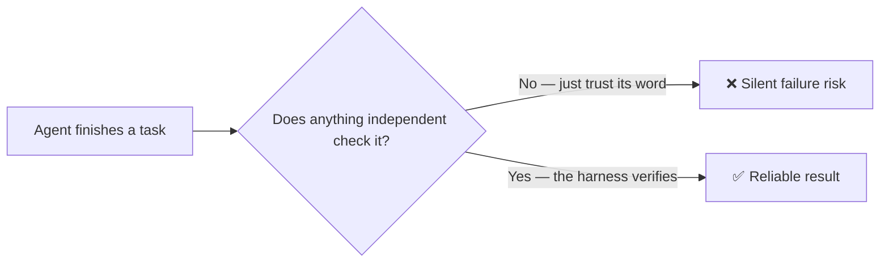

# agent-harness-lab

*[English](README.md) | [日本語](README_ja.md)*

**A field guide to the sneaky ways AI coding agents fail — and simple fixes that actually stop them.**

AI coding agents rarely fail with a big red error message. Instead:

- They say "done" when the work isn't actually done.
- They review their own code and give themselves a passing grade.
- They quietly weaken a failing test until it passes, instead of fixing the real bug.
- Sometimes they even describe an attack that never happened.

Every pattern below is something we've watched happen in real agent sessions, cross-checked against what other people have written about the same problem. For each one you get: what it looks like, why it happens, and a fix you build into your setup — not just a prompt asking the agent to please not do that.



> **What's a "harness"?** Everything around the AI model that isn't the model itself: the rules you set, the checks that run automatically, the guardrails that catch mistakes. The model supplies the intelligence. The harness is what keeps that intelligence from going off the rails. (Term coined by Mitchell Hashimoto in 2026; popularized by OpenAI's "Harness Engineering.")

## The 10 failure patterns

| # | Pattern | What it looks like | The fix |
|---|---------|-----------------|---------------------|
| 1 | [Completion Misidentification](patterns/completion-misidentification.md) | Says "done" before it's actually done | Require an outside check before accepting "done" |
| 2 | [Quality Self-Overconfidence](patterns/quality-self-overconfidence.md) | Reviews its own work and calls it good | Have a *different* agent (fresh eyes) review it |
| 3 | [Cumulative Deviation](patterns/cumulative-deviation.md) | Tiny drifts add up over many steps until the result no longer matches the goal | Check back against the original spec every so often |
| 4 | [Goal Drift](patterns/goal-drift.md) | Important constraints get forgotten, especially after long conversations get summarized | Keep constraints in a file the agent re-reads, not just in memory |
| 5 | [Functional Stubs](patterns/functional-stubs.md) | A button exists but doesn't actually do anything — and the tests still pass | Actually click the button and see what happens, don't just read the code |
| 6 | [Step-Skip Rationalization](patterns/step-skip-rationalization.md) | Comes up with a good-sounding reason to skip a safety check | Don't let the agent decide for itself when a check is optional |
| 7 | [Context Pollution Cascade](patterns/context-pollution-cascade.md) | One agent's small mistake gets passed to the next agent, who builds on it and makes it worse | Be explicit about what each agent can trust vs. must double-check |
| 8 | [Emergent Menu Drift](patterns/emergent-menu-drift.md) | Offers you extra choices that weren't part of the original plan | Lock the choices down to exactly what was designed |
| 9 | [Verifier Theater](patterns/verifier-theater.md) | "Passes" the work by quietly rewriting the failing test | The checker shouldn't be allowed to edit the tests it's grading |
| 10 | [Phantom Confabulation](patterns/phantom-confabulation.md) | Reports being hacked, or talking to someone, when neither actually happened | Check the raw transcript for who actually said what |

### How this should change the way you work

- Expect roughly **1 in 10** (sometimes 1 in 5) unsupervised agent runs to go wrong in one of these ways.
- You can't write a prompt good enough to get that to zero.
- What works instead: run more than one check, and never just take the agent's word that something succeeded.

### Five habits that prevent most of this

- **Limit what it can touch** — permission to edit config files, not to push straight to production.
- **Give it less, but better, context** — a short, focused set of instructions beats a giant wall of rules.
- **Make checks mandatory, not optional** — tests run automatically as a required step, not something you hope the agent remembers.
- **Undo automatically when something breaks**, instead of hoping the agent notices and fixes it.
- **Remove old safety nets once you don't need them** — as the tools improve, some workarounds become unnecessary weight.

> One-line version: *don't ask the agent to run the tests — set things up so the tests run no matter what the agent decides to do.*

## Install as a Claude Code plugin

```text
/plugin marketplace add hiro178/agent-harness-lab
/plugin install drift-patterns@agent-harness-lab
```

### What's available right now

| Plugin | What it actually does for you |
|--------|-------------------|
| [`drift-patterns`](plugins/drift-patterns/) | Loads the 10 failure patterns above as an on-demand skill, so your AI assistant can recognize them and suggest the right fix |
| [`tool-channel-resilience`](plugins/tool-channel-resilience/) | Rules for when the connection between the AI and its tools gets flaky (empty results, stalled responses) — keep changes small, run heavy commands in the background, double-check edits |
| [`systematic-debugging`](plugins/systematic-debugging/) | A debugging checklist that won't let the agent guess-and-check its way to a "fix" — plus a rule for when it should stop and ask a human instead of deciding alone |
| [`knowledge-import`](plugins/knowledge-import/) | A safety check for feeding outside articles into your project. It won't let one unverified blog post silently rewrite your rules — it needs a second, independent source to agree first |

## More on the way

This repo adds small, focused tools like these over time:

- More debugging help
- Ways to test your own automation scripts
- An experimental setup that pits two AI agents against each other (one writes code, one tries to break it) to catch bugs a single reviewer would miss

See the [roadmap](docs/plans/2026-07-12-roadmap.md) for what's coming.

## Where this comes from

This catalog mixes our own hands-on observations with things other people have written about the same failures. Credited pattern by pattern:

- Fukushima (LayerX, 2026-04)
- Rajasekaran (Anthropic, 2026-03)
- Thariq & Sid Bidasaria (Anthropic, 2026-06)
- AWS Labs aidlc-workflows (MIT-0)
- Addy Osmani
- Block Engineering
- Seino (Classmethod)
- Steinberger (OpenClaw)
- AL-Awady
- Two academic papers: arXiv:2306.05499, arXiv:2503.16248

Where a pattern is marked as ours, it's something we watched happen firsthand in long-running agent sessions before we found anyone else describing it.

## License

MIT
