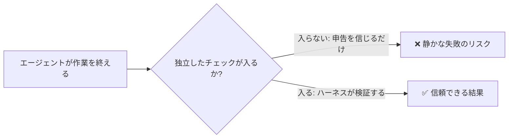

# agent-harness-lab

*[English](README.md) | [日本語](README_ja.md)*

**AIコーディングエージェントが気づかないうちに失敗する、よくある手口の見取り図 —— そして実際に効く直し方。**

AIコーディングエージェントは、大きなエラーメッセージを出して派手に失敗することは滅多にない。代わりに何が起きるかというと:

- まだ終わっていないのに「完了」と言う
- 自分のコードを自分でレビューして自分に合格点をつける
- 本当のバグを直す代わりに、失敗しているテストの方をこっそり弱めて通してしまう
- 時には、起きてもいない攻撃を報告することさえある

以下の各パターンは、実際のエージェントセッションで実際に観察したもので、他の人が同じ問題について書いている内容とも突き合わせて確認済みだ。それぞれについて、どんな見た目をしているか・なぜ起きるか・そして「エージェントにお願いする」のではなく仕組みとして組み込める直し方を示す。



> **「ハーネス」って何?** AIモデル自体ではない、その周りにあるすべてのもの: 設定したルール、自動で走るチェック、間違いを捕まえるガードレール。モデルは知性を提供し、ハーネスはその知性が脱線しないよう抑える役割を担う。（用語は Mitchell Hashimoto が 2026 年に提唱し、OpenAI の "Harness Engineering" で広まった。）

## 10 の失敗パターン

| # | パターン | どんな見た目か | 直し方 |
|---|---------|-----------------|---------------------|
| 1 | [Completion Misidentification](patterns/completion-misidentification.md) | 実際には終わっていないのに「完了」と言う | 「完了」を受け入れる前に外部チェックを必須にする |
| 2 | [Quality Self-Overconfidence](patterns/quality-self-overconfidence.md) | 自分の作業を自分でレビューして合格にする | *別の*エージェント（先入観のない目）にレビューさせる |
| 3 | [Cumulative Deviation](patterns/cumulative-deviation.md) | 小さなズレが何ステップも積み重なり、結果が目的からずれる | 定期的に元の仕様と照らし合わせる |
| 4 | [Goal Drift](patterns/goal-drift.md) | 重要な制約が忘れられる。特に長い会話が要約された後に起きやすい | 制約はエージェントが読み返すファイルに置く。記憶頼みにしない |
| 5 | [Functional Stubs](patterns/functional-stubs.md) | ボタンはあるが実際には何も起きない — それでもテストは通る | コードを読むだけでなく、実際にボタンを押して確認する |
| 6 | [Step-Skip Rationalization](patterns/step-skip-rationalization.md) | 安全チェックを飛ばすもっともらしい理由を考え出す | チェックを省略していいかどうかをエージェント自身に判断させない |
| 7 | [Context Pollution Cascade](patterns/context-pollution-cascade.md) | あるエージェントの小さな間違いが次のエージェントに渡り、それを土台にさらに悪化する | 各エージェントが「信じてよいもの」と「必ず再確認すべきもの」を明確に分ける |
| 8 | [Emergent Menu Drift](patterns/emergent-menu-drift.md) | 元の計画にはなかった選択肢を勝手に提示してくる | 選択肢を設計どおりのものだけに固定する |
| 9 | [Verifier Theater](patterns/verifier-theater.md) | 失敗しているテストをこっそり書き換えて作業を「合格」にする | 採点する側がその採点対象のテストを編集できないようにする |
| 10 | [Phantom Confabulation](patterns/phantom-confabulation.md) | 起きていない攻撃や、していない会話を報告する | 生のログを見て、実際に誰が何を言ったかを確認する |

### これが仕事の進め方にとって意味すること

- 自律実行するエージェントセッションのうち、だいたい**10回に1回**（時には5回に1回）はこれらのどれかの形で誤ると思っておく
- プロンプトをどれだけ工夫してもゼロにはできない
- 代わりに効くのは: チェックを1つだけでなく複数走らせること、そして「成功しました」というエージェント自身の申告を鵜呑みにしないこと

### たいていの問題を防ぐ5つの習慣

- **触れる範囲を制限する** — 設定ファイルの編集は許可しても、本番環境への直接反映までは許可しない
- **情報量ではなく、密度を上げる** — 分厚いルール集より、短く焦点の絞られた指示のほうが効く
- **チェックを「任意」ではなく「必須」にする** — テストはエージェントが覚えていてくれることを願うものではなく、自動で必ず走る仕組みにする
- **問題が起きたら自動で元に戻す** — エージェントが気づいて直してくれることを期待しない
- **不要になった安全策は外す** — ツールの性能が上がるにつれ、以前の回避策が余計な重荷になることがある

> 一言で言えば: *「テストを実行して」とエージェントにお願いするのではなく、エージェントが何を判断しようとテストが必ず走る仕組みにする*。

## Claude Code プラグインとしてインストール

```text
/plugin marketplace add hiro178/agent-harness-lab
/plugin install drift-patterns@agent-harness-lab
```

### 今すぐ使えるもの

| プラグイン | 実際に何をしてくれるか |
|--------|-------------------|
| [`drift-patterns`](plugins/drift-patterns/) | 上記10パターンをオンデマンドのスキルとして読み込む。AIアシスタントがこれらを認識し、正しい直し方を提案できるようになる |
| [`tool-channel-resilience`](plugins/tool-channel-resilience/) | AIとツールの間の接続が不安定なとき（結果が空になる・応答が止まる）の対処ルール。変更は小さく保つ、重い処理はバックグラウンドで走らせる、編集後は必ず確認する |
| [`systematic-debugging`](plugins/systematic-debugging/) | エージェントが当てずっぽうで「直った」ことにしてしまわないようにするデバッグ手順。加えて、独断で判断せず人間に立ち止まって確認すべきタイミングのルール |
| [`knowledge-import`](plugins/knowledge-import/) | 外部の記事をプロジェクトに取り込む際の安全チェック。裏取りされていないブログ記事1本でルールが書き換わってしまうことがないよう、独立した2つ目の情報源が一致することを要求する |

## 今後の追加予定

このリポジトリは、こうした小粒で焦点の絞られたツールを今後も継続的に追加していく:

- さらなるデバッグ支援
- 自分の自動化スクリプトをテストする仕組み
- 実験的な取り組みとして、1つのAIがコードを書き、もう1つのAIがそれを壊そうとする形で、1人のレビュアーでは見逃すバグを捕まえる仕組み

今後の計画は [ロードマップ](docs/plans/2026-07-12-roadmap.md) を参照。

## 出典

このカタログは、自分たちが実際に手を動かして観察した内容と、同じ問題について他の人が書いた内容を組み合わせたもの。パターンごとの出典:

- Fukushima (LayerX, 2026-04)
- Rajasekaran (Anthropic, 2026-03)
- Thariq & Sid Bidasaria (Anthropic, 2026-06)
- AWS Labs aidlc-workflows (MIT-0)
- Addy Osmani
- Block Engineering
- Seino (Classmethod)
- Steinberger (OpenClaw)
- AL-Awady
- 学術論文2本: arXiv:2306.05499、arXiv:2503.16248

「独自の観察」と明記した行は、他の誰かが同じことを書いているのを見つける前に、自分たちが実際のエージェントセッションで直接目撃したものだ。

## ライセンス

MIT
