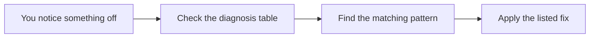

# drift-patterns plugin

*[English](README.md) | [日本語](README_ja.md)*

Loads a list of 10 sneaky ways AI agents fail, plus how to spot each one and what to do about it.



## What you get

- A self-contained catalog of 10 failure patterns your AI assistant can load whenever it's relevant.
- A diagnosis table for matching a symptom you're seeing to the pattern it's probably caused by.
- A checklist for building safeguards into a new project *before* these problems show up.

## Install

```text
/plugin marketplace add hiro178/agent-harness-lab
/plugin install drift-patterns@agent-harness-lab
```

## When it kicks in

Loads automatically when you're:

- designing how an AI agent or automated workflow should be set up,
- trying to figure out why an unsupervised agent quietly went wrong,
- checking a multi-step AI pipeline for reliability.

The full write-up for each pattern — real examples, sources — lives in the repository's [`patterns/`](../../patterns/) folder.
