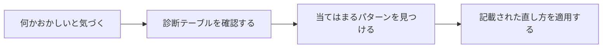

# drift-patterns plugin

*[English](README.md) | [日本語](README_ja.md)*

AIエージェントが気づかないうちに失敗する10の手口と、それぞれの見分け方・対処法をまとめて読み込むプラグイン。



## 何が手に入るか

- 10の失敗パターンを自己完結でまとめたカタログ。必要なときにAIアシスタントが読み込める
- 目の前で起きている症状がどのパターンに当てはまるかを見分けるための対応表
- 問題が起きる*前*に新しいプロジェクトへ安全策を組み込むためのチェックリスト

## インストール

```text
/plugin marketplace add hiro178/agent-harness-lab
/plugin install drift-patterns@agent-harness-lab
```

## 発動タイミング

以下の場面で自動的に読み込まれる:

- AIエージェントや自動化ワークフローの設計をしているとき
- 監視なしで動いていたエージェントが、なぜか気づかないうちに間違った理由を突き止めようとしているとき
- 複数ステップのAIパイプラインの信頼性をチェックしているとき

各パターンの詳しい解説（実例・出典）はリポジトリの [`patterns/`](../../patterns/) フォルダにある。
