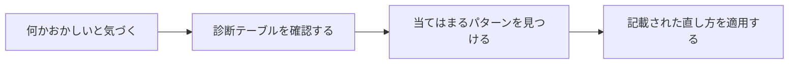

# drift-patterns plugin

*[English](README.md) | [日本語](README_ja.md)*

AIエージェントが気づかないうちに失敗する10の手口と、それぞれの見分け方・対処法をまとめて読み込むプラグイン。



## 何が手に入るか

- 10の失敗パターンを自己完結でまとめたカタログ（AIアシスタントが必要なときに読める）
- 目の前の症状がどのパターンかを判定する対応表
- 新しいプロジェクトに事前に安全策を組み込むためのチェックリスト

## インストール

```text
/plugin marketplace add hiro178/agent-harness-lab
/plugin install drift-patterns@agent-harness-lab
```

## 使うときは?

以下の場面で読み込まれる:

- AIエージェントや自動化ワークフローの設計をしているとき
- 無人で走っていたエージェントがうっかり間違った理由を突き止めているとき
- 複数ステップのAIパイプラインをチェックしているとき

各パターンの詳しい解説（実例・出典）はリポジトリの [`patterns/`](../../patterns/) フォルダにある。
