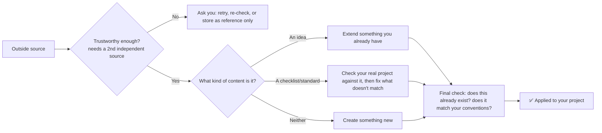

# knowledge-import plugin

*[English](README.md) | [日本語](README_ja.md)*

A safety check for feeding outside content into your project — not "read a link and summarize it."

## The problem with the naive version

Tell an agent to "import this article as a rule" and it will happily read one blog post and rewrite your project's guidelines based on it. One unverified source now has write access to how your whole project is supposed to work. This plugin adds the missing safety check: content only becomes a real change after it clears a few gates — all enforced automatically, not just suggested in a prompt the agent can talk itself out of following.



## What makes this different from "read a link and summarize it"

- **It checks how trustworthy the source is, and asks for a second opinion.** Sources get ranked — official docs and peer-reviewed papers rank highest, a random personal blog ranks lowest — and the agent can't quietly upgrade a source's ranking to make its own life easier. A single low-ranked source can't change anything on its own; it needs a second, independent source to agree, or an explicit "yes, use just this one" from you.
- **It tells apart three outcomes that usually get lumped together**: extending something you already have with a new insight, creating something brand new, or — when the imported content is a checklist/standard rather than an idea — actually checking your real project against it and fixing what doesn't match (with a preview of every change, a backup, and a sign-off required for anything risky).
- **Exact duplicates get blocked outright**, not silently created twice.
- **Nothing ships without passing a final check** — formatting, structure, "does this already exist," does it match your project's conventions.

## Install

```text
/plugin marketplace add hiro178/agent-harness-lab
/plugin install knowledge-import@agent-harness-lab
```

## When it kicks in

- When you ask to import, integrate, or fold outside content into your project.
- When you want to check something real (a config file, a piece of code) against a checklist or standard you found somewhere.

The full step-by-step process — how sources get ranked, how content gets classified, how fixes get applied safely — lives in [`skills/knowledge-import/SKILL.md`](skills/knowledge-import/SKILL.md) and its `references/` folder.
