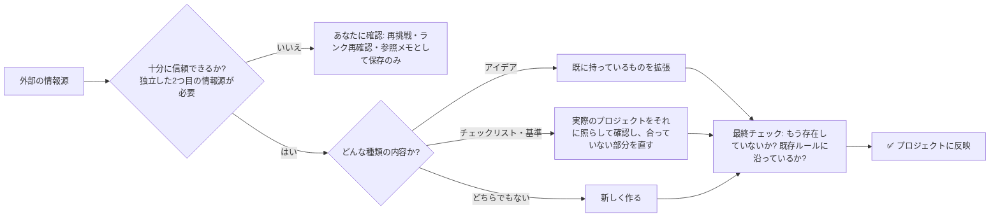

# knowledge-import plugin

*[English](README.md) | [日本語](README_ja.md)*

外部のコンテンツをプロジェクトに取り込む際の安全チェック —— 「リンクを読んで要約する」だけではない。

## よくある問題

エージェントに「この記事をルールに」と頼むと、ブログ記事を1本読んで、それだけでプロジェクトの指針を書き換えてしまう。未検証の情報源1つに、プロジェクト全体の動きを決める権を与えてしまう。このプラグインは、欠けていたゲートを追加する。コンテンツが実際に反映されるのは複数のチェックを通った後だけだ。プロンプトの「してください」では回避できない。



## 「リンク読み込み」との違い

- **情報源の信頼度をチェック、複数根拠を求める** — 公式ドキュメントや査読論文が上、個人ブログが下のランク付け。エージェントがランクを上げるのは禁止。低ランク情報源だけでは変更不可、独立した2つ目の同一情報源が必須か、あなたの明示承認のみ例外。
- **3種の変更を区別** — 既存の拡張 vs 新規作成 vs 基準チェック後の修正（すべて事前プレビュー・バックアップ付き）。リスク大な変更は人間承認を必須に。
- **重複ブロック** — 重複作成なし。
- **最終チェック必須** — 書式・構造・重複確認・既存ルール準拠をすべて確認してから反映。

## インストール

```text
/plugin marketplace add hiro178/agent-harness-lab
/plugin install knowledge-import@agent-harness-lab
```

## 使うときは?

- 外部コンテンツをプロジェクトに取り込む時
- 見つけたチェックリストや基準に照らして、設定やコードを確認する時

具体的な手順（ランク付け・分類・変更の安全な適用）は [`skills/knowledge-import/SKILL.md`](skills/knowledge-import/SKILL.md) とその `references/` フォルダにある。
