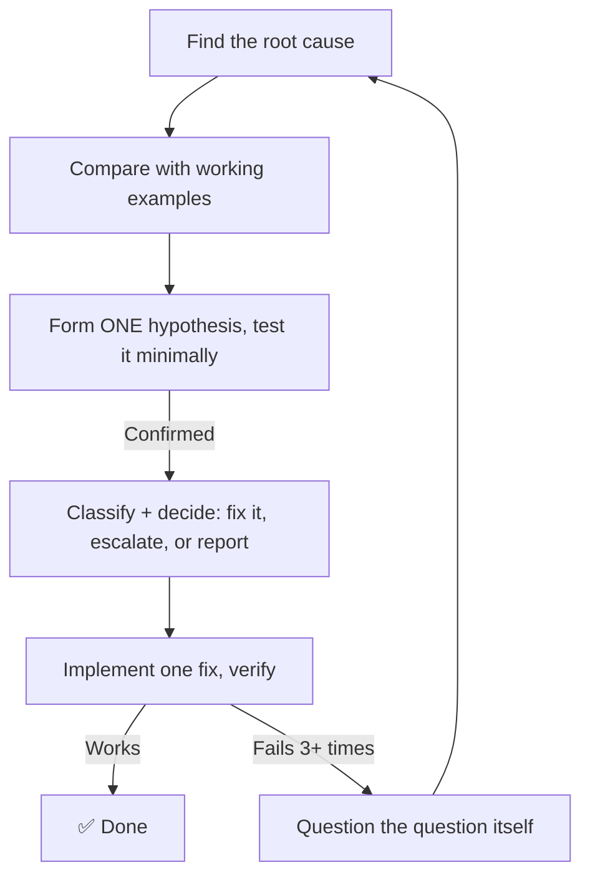

# systematic-debugging plugin

*[English](README.md) | [日本語](README_ja.md)*

A debugging process that won't let an AI agent guess its way to a "fix" — built for agent workflows, not just solo developers.



## What's different from the well-known version

The core four steps (investigate → look for similar working code → form one theory and test it → implement) come from the systematic-debugging approach in [obra/superpowers](https://github.com/obra/superpowers) (MIT license), credited inside the skill itself. This plugin adds four things that matter specifically when an *agent*, not a human, is doing the debugging:

- **A 10-item list of root-cause types** — gives the agent's diagnosis a consistent label (`LOGIC_ERROR`, `CONFIG_GAP`, `SPEC_CONFLICT`, …) so different sessions and different agents can be compared apples-to-apples.
- **A "stop and ask a human" rule** — spells out exactly when the agent must NOT decide alone: spec disagreements, anything needing credentials it shouldn't have, anything that would break a public API.
- **A fixed report format** — so whatever picks up the agent's diagnosis next, a person or another agent, can read it without guessing what each field means.
- **A rule for after 3 failed fixes** — stop trying to fix the answer, and question whether you're even solving the right problem. "How do I make X faster?" becomes "should X even happen at all?" Removing unnecessary work usually beats speeding it up.

## Install

```text
/plugin marketplace add hiro178/agent-harness-lab
/plugin install systematic-debugging@agent-harness-lab
```

## When it kicks in

Whenever you hit a bug, a failing test, or something behaving unexpectedly — before proposing any fix. It's designed to matter most exactly when you're least inclined to follow it: under time pressure, with an "obvious" quick fix already in hand.
