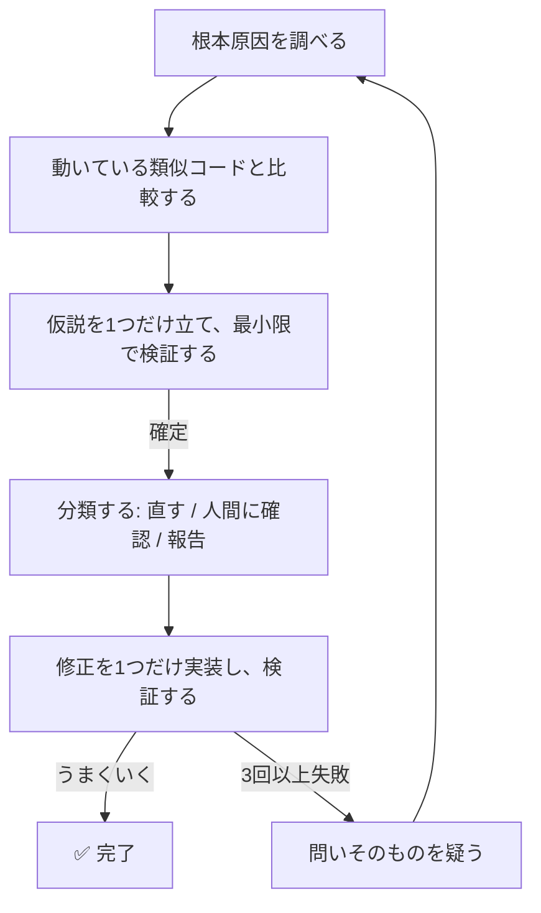

# systematic-debugging plugin

*[English](README.md) | [日本語](README_ja.md)*

AIエージェントが当てずっぽうで「直った」ことにしてしまわないようにするデバッグ手順 —— 1人の開発者向けではなく、エージェントのワークフロー向けに作られている。



## よく知られたバージョンとの違い

核となる4ステップ（調査する → 似た動くコードを探す → 1つの仮説を立てて検証する → 実装する）は [obra/superpowers](https://github.com/obra/superpowers)（MITライセンス）のシステマティックデバッグの手法によるもので、スキル内でも出典を明記している。このプラグインは、人間ではなく*エージェント*がデバッグを行う場合に特に重要になる4つの要素を追加している:

- **根本原因の10分類リスト** — エージェントの診断結果に一貫したラベル（`LOGIC_ERROR`・`CONFIG_GAP`・`SPEC_CONFLICT` など）を付けることで、別のセッション・別のエージェント同士でも同じ基準で比較できるようにする
- **「立ち止まって人間に確認する」ルール** — エージェントが独断で決めてはいけない場面を具体的に定める: 仕様の食い違い、持つべきでない権限が必要な場合、公開APIを壊してしまう変更
- **固定のレポート形式** — エージェントの診断結果を次に受け取るのが人間であれ別のエージェントであれ、各項目が何を意味するか推測せずに読めるようにする
- **修正が3回失敗した後のルール** — 答えを直そうとし続けるのをやめて、そもそも解くべき問いが正しいかを疑う。「どうやってXを速くするか」を「そもそもXは必要か」に変える。不要な作業をなくすことは、たいてい速くすることより効果が大きい

## インストール

```text
/plugin marketplace add hiro178/agent-harness-lab
/plugin install systematic-debugging@agent-harness-lab
```

## 発動タイミング

バグ・テスト失敗・想定外の挙動に遭遇し、修正を提案する前に発動する。時間に追われていて、手元に「明らかな」応急処置がある —— まさに従いたくない瞬間にこそ、最も価値を発揮するよう設計されている。
