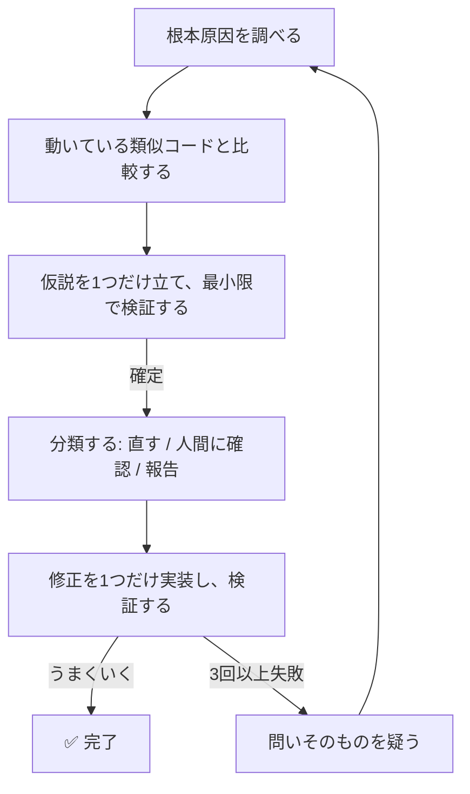

# systematic-debugging plugin

*[English](README.md) | [日本語](README_ja.md)*

AIエージェントが当てずっぽうで「直った」ことにしてしまわないようにするデバッグ手順 —— 1人の開発者向けではなく、エージェントのワークフロー向けに作られている。



## 既存手法との違い

根幹の4ステップ（調査 → 動く類似コード探索 → 単一仮説検証 → 実装）は [obra/superpowers](https://github.com/obra/superpowers)（MIT）のシステマティックデバッグが出典だ。このプラグインは、人間ではなくエージェントがデバッグするとき特に重要な4つを加えている:

- **原因10分類リスト** — 診断結果に一貫したラベル（`LOGIC_ERROR`・`CONFIG_GAP`・`SPEC_CONFLICT` など）を付け、セッション間・エージェント間でも同じ基準で比較可能にする
- **「確認して進む」ルール** — エージェントが独断で決めてはいけない場面: 仕様の食い違い、本来不要な権限の使用、公開APIへの破壊的変更
- **固定レポート形式** — 診断結果が人間でも別のエージェントでも、各項目が明確に読める形
- **3回失敗後のルール** — 答え直しを止め、問い自体が正しいか問い直す。「Xを速くするには」を「Xは必要か」に変える。不要な作業削減は、大抵速度向上より効果がある

## インストール

```text
/plugin marketplace add hiro178/agent-harness-lab
/plugin install systematic-debugging@agent-harness-lab
```

## 使うときは?

バグやテスト失敗に直面した時、修正を提案する前に走る。時間に追われていて、「明らかな」応急処置が目の前にある —— その、やりたくない瞬間にこそ最も役に立つ。
