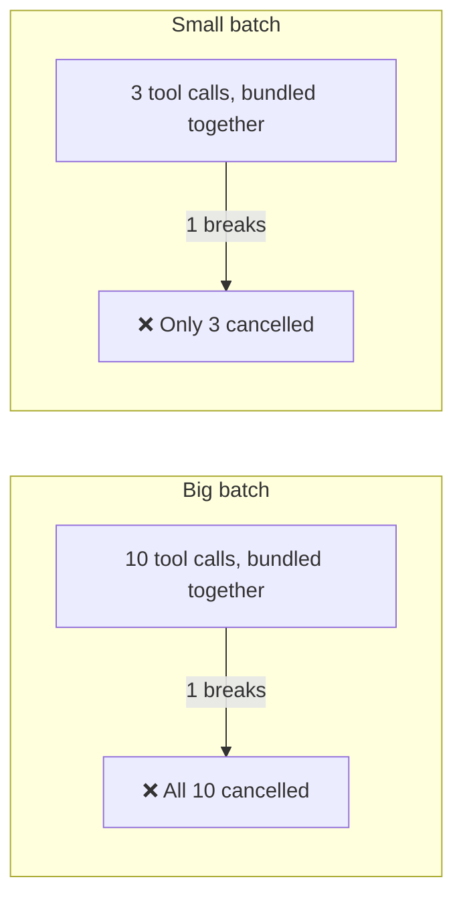

# tool-channel-resilience plugin

*[English](README.md) | [日本語](README_ja.md)*

Rules for what to do when the connection between an AI agent and its tools gets flaky.

## The problem

Sometimes the plumbing between an AI and the commands it runs just misbehaves:

- A tool call comes back empty or cut off.
- A trivial command like `echo ok` returns nothing.
- Several tool calls bundled in one batch all get cancelled at once.
- A response just stops in the middle of running a command.

The instinctive reactions — retry harder, or add a prompt saying "please be careful with tool calls" — don't work. **This is a plumbing problem, not a behavior problem**, so telling the agent to behave differently doesn't fix it.

## The idea: you can't prevent it, but you can limit the damage

No amount of prompting makes a flaky connection reliable. What you *can* control is how much damage one hiccup causes — mainly by keeping batches small:



The four habits that come out of that idea:

- **Keep batches small** — one broken call can cancel everything else bundled with it, so bundle less.
- **Run heavy commands in the background and check back later** instead of waiting on a connection that might drop.
- **Check your work after every edit** — while it's still one `git checkout` away from being undone, instead of ten edits later.
- **When things are truly stuck, save what you have and say so** — don't keep retrying blindly.

## What's inside

- A checklist for recognizing when the connection has gone flaky
- Eight concrete habits with the reasoning behind each
- A copy-pasteable pattern for running a slow command in the background and checking on it later (works on macOS/BSD too, where some common tricks like the `timeout` command don't exist)

## Install

```text
/plugin marketplace add hiro178/agent-harness-lab
/plugin install tool-channel-resilience@agent-harness-lab
```

## When it kicks in

- Automatically, when tool calls start failing in the ways described above.
- Proactively, if you're running a long unsupervised session where a connection hiccup would be expensive.
