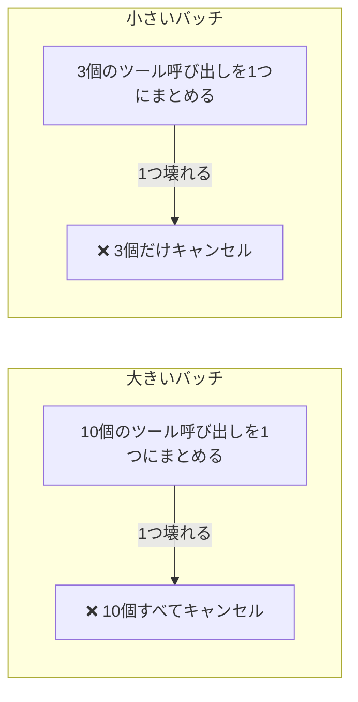

# tool-channel-resilience plugin

*[English](README.md) | [日本語](README_ja.md)*

AIエージェントとツールの間の接続が不安定になったときにどうすればよいかをまとめたルール集。

## 問題

AIが実行するコマンドとの間の「配線」がおかしくなることがある:

- ツールの実行結果が空で返ってきたり途中で切れたりする
- `echo ok` のような単純なコマンドが何も返さない
- 1回のバッチにまとめた複数のツール呼び出しがまとめてキャンセルされる
- コマンドの実行中に応答がそのまま止まる

本能的な反応 — もっと強くリトライする、「ツール呼び出しには気をつけて」というプロンプトを足す — はどちらも効かない。**これは配線の問題であって、振る舞いの問題ではない**ので、エージェントに違うやり方をお願いしても直らない。

## 考え方: 防げないなら、被害を小さくする

どれだけプロンプトを工夫しても、不安定な接続そのものを安定させることはできない。コントロールできるのは、1回のトラブルがもたらす被害の大きさだけだ — 主にバッチを小さく保つことで:



この考え方から出てくる4つの習慣:

- **バッチを小さく保つ** — 1つの壊れた呼び出しが、一緒にまとめた他のすべてをキャンセルしてしまうことがある。まとめる数を減らせば被害も小さくなる
- **重いコマンドはバックグラウンドで走らせ、あとで確認する** — 接続が途切れるかもしれない状態で待ち続けない
- **編集のたびに確認する** — `git checkout` 一発で元に戻せるうちに気づく。10回編集した後で気づくのでは遅い
- **本当に手詰まりのときは、今あるものを保存して伝える** — 盲目的にリトライを続けない

## 中身

- 接続が不安定になっているサインを見分けるチェックリスト
- 根拠つきの具体的な習慣8つ
- 重いコマンドをバックグラウンドで走らせてあとで確認する、そのままコピペできる手順（macOS/BSD でも動く — `timeout` コマンドのような一部の便利なトリックが使えない環境向け）

## インストール

```text
/plugin marketplace add hiro178/agent-harness-lab
/plugin install tool-channel-resilience@agent-harness-lab
```

## 発動タイミング

- 上記のような形でツール呼び出しが失敗し始めたら自動的に
- 接続の不調が痛手になる長時間の自律セッションを走らせる前に、予防的に
