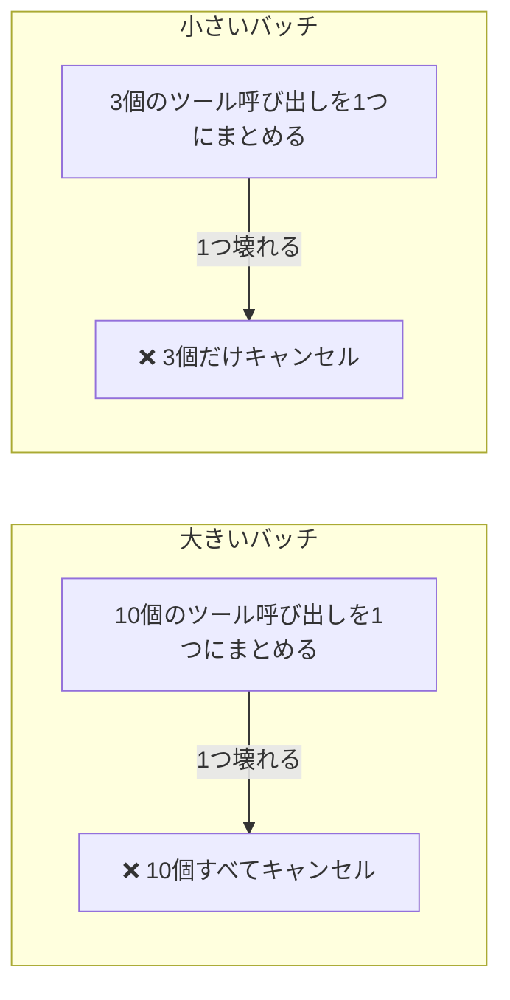

# tool-channel-resilience plugin

*[English](README.md) | [日本語](README_ja.md)*

AIエージェントとツールの間の接続が不安定になったときにどうすればよいかをまとめたルール集。

## 問題

AIが実行するコマンドとの間の「配線」がおかしくなることがある:

- ツールの実行結果が空で返ってきたり途中で切れたりする
- `echo ok` のような単純なコマンドが何も返さない
- 1回のバッチにまとめた複数のツール呼び出しがまとめてキャンセルされる
- コマンドの実行中に応答がそのまま止まる

よくある反応 — リトライを増やす、プロンプトで「気をつけて」と言う — は効かない。**これは接続の問題であって、エージェントの問題ではない**からだ。

## 考え方：防げなければ被害を絞る

プロンプト工夫だけでは、不安定な接続そのものは直らない。制御できるのは被害の大きさだけ — バッチを小さく保つことで:



この考え方から出てくる4つの習慣:

- **バッチを小さく** — 1つのツール呼び出しが壊れると、同じバッチ内の全部がキャンセルされる。数を減らせば被害も減る
- **重い処理はバックグラウンドで実行** — 接続が途切れそうな状態で待たない
- **編集したら即確認** — `git checkout` で戻せるうちに気づく。10回編集してから気づくのでは遅い
- **詰まったら保存して報告** — リトライだけで進まない

## 中身

- 接続の不調を判定するチェックリスト
- 根拠付きの習慣8つ
- 重い処理をバックグラウンドで実行、あとで確認する実装例（macOS/BSD対応 — `timeout` など一部のコマンドに頼らない形）

## インストール

```text
/plugin marketplace add hiro178/agent-harness-lab
/plugin install tool-channel-resilience@agent-harness-lab
```

## 使うときは?

- ツール呼び出しが失敗し始めたら
- 長時間の自律セッションを走らせる前に、予防的に
